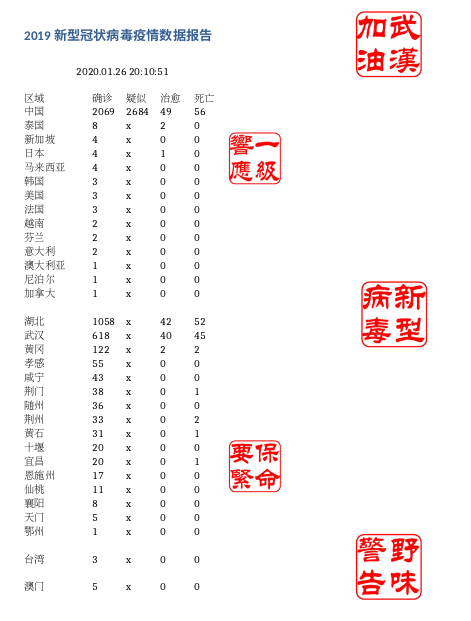

# 2019 新型冠状病毒感染地区报告
:experimental:
:author: 'Shieber'
:date: '2020.01.26'

### 描述
[link:README.adoc[English]] 将感染地区分省市列出，并添加水印。

### 兼容系统
- Linux

### 使用
python NCoronReport.py

### 依赖
- bs4
- docx
- python3
- Selenium 及对应webdriver
- libreoffice 或 pandoc
- Text2docx,Docx2pdf,Addmark (我写的系统程序， https://gitee.com/QMHTMY/Text2docx2pdf[此处]可下载)

### 结果展示

